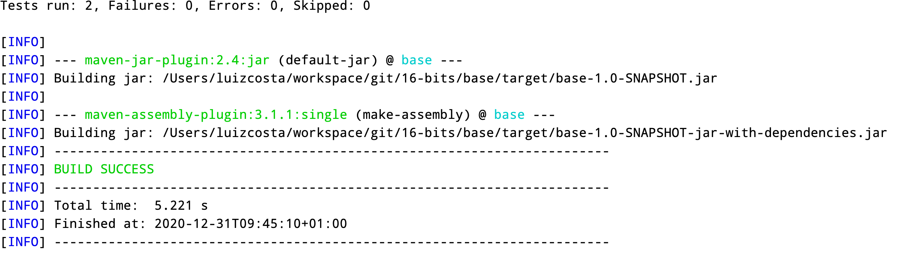
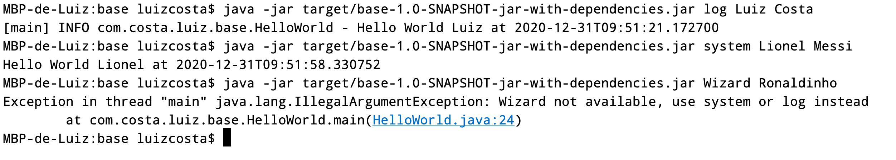

# Base

## Introduction
This is the base project, without any framework (Spring, DropWizard, Quarkus, etc)

This project has the intent to show the Java features as is.

## How to run?
### By jar
Execute the command ``mvn clean package``

 
..........
 

After the package the project execute the following command into your terminal

``java -jar target/base-1.0-SNAPSHOT-jar-with-dependencies.jar log Luiz Costa``

Remember! The first argument should be "log" or "system" and the second a name.

Below there are 3 examples, using log, system and one unavailable that is Wizard. 

 