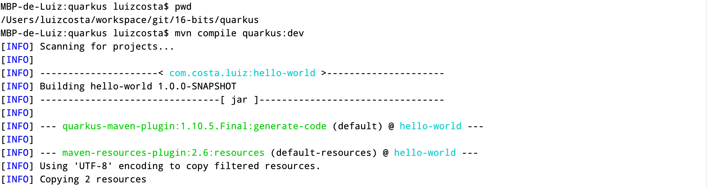
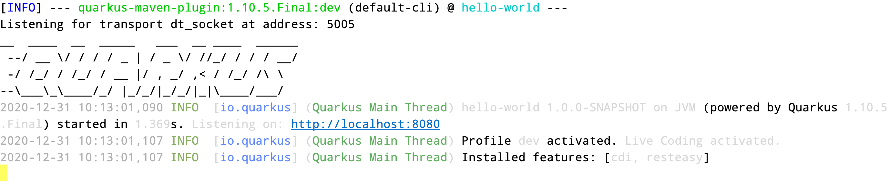
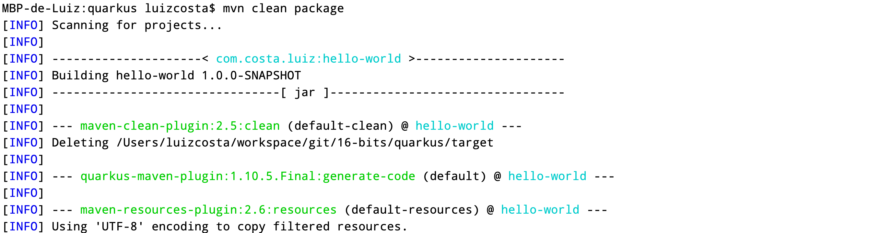
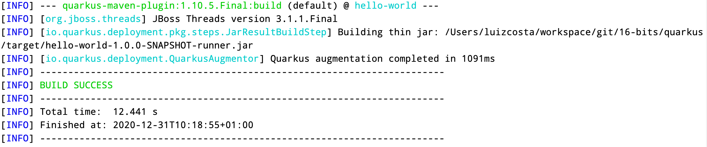
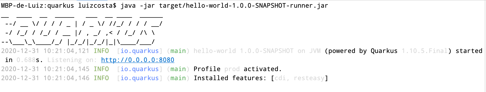
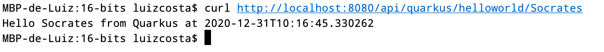
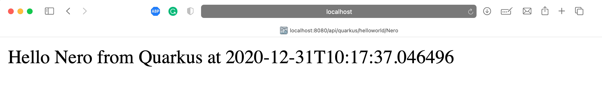

# Quarkus

## Introduction
This is the Quarkus project, that's it.

## How to run?

### By terminal
By terminal use the command ``mvn compile quarkus:dev``

 
..
 

### By jar
Execute the command ``mvn clean package``

 
..........
 

After the package the project execute the following command into your terminal

``java -jar target/hello-world-0.0.1-SNAPSHOT.jar``

*Please, check again the message*, the application has started in 0.688s, is really fast!!  

## How to call

### cURL
cURL runs on terminal, so open the terminal and execute the following code 
``curl http://localhost:8080/api/quarkus/helloworld/Socrates``

### Browser

Using the browser, just type ``http://localhost:8090/api/spring/helloworld/16bits``

 