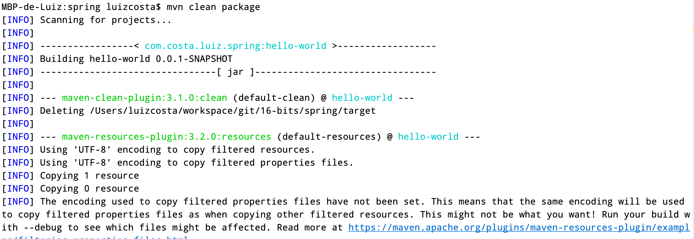
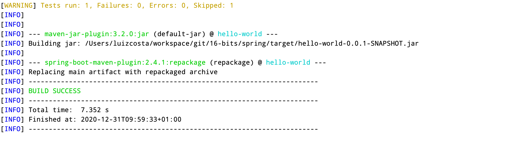
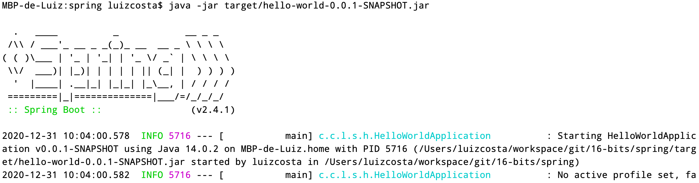
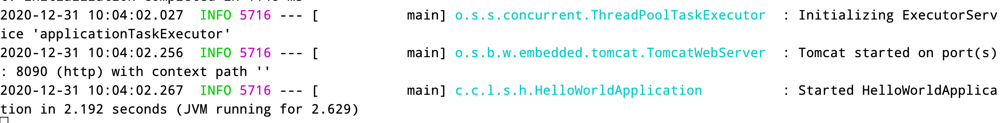
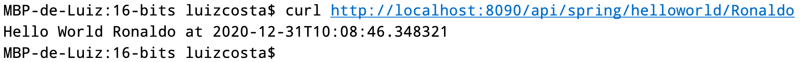
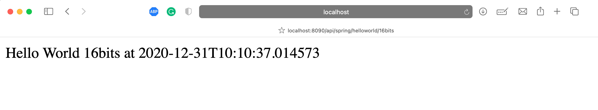

# Spring

## Introduction
This is the Spring project.

## How to run?

### By class
Execute the class HelloWorldApplication, then the application will start.

The default port has been modified to 8090.

### By jar
Execute the command ``mvn clean package``

 
..........
 

After the package the project execute the following command into your terminal

``java -jar target/hello-world-0.0.1-SNAPSHOT.jar``

.. 
 

After the message *Started HelloWorldApplication* the application is ready to receive requests.

## How to call

### cURL
cURL runs on terminal, so open the terminal and execute the following code 
``curl http://localhost:8090/api/spring/helloworld/Ronaldo``

### Browser

Using the browser, just type ``http://localhost:8090/api/spring/helloworld/16bits``

### By docker

#### Build the image
docker build -t spring/hello-docker .

#### List images

``docker image ls``

#### Run
``docker run -p<expose port>:<internal port>  <imageid>``
 
``docker run -p8090:8090 a0733cb9a156``

#### See all containers
``docker container ls``

#### Run container
``docker exec -it <container_id> /bin/bash``
 
``docker exec -it 2c0b30ec415d /bin/bash``

#### Stop and remove containers
``docker stop $(docker ps -a -q)``

``docker rm $(docker ps -a -q)``

### Remove all images
``docker system prune``

### Remove all images 
``docker rmi -f $(docker images -a -q)``

#### See the Linux version
``docker exec -it <containerid> cat /etc/os-release``